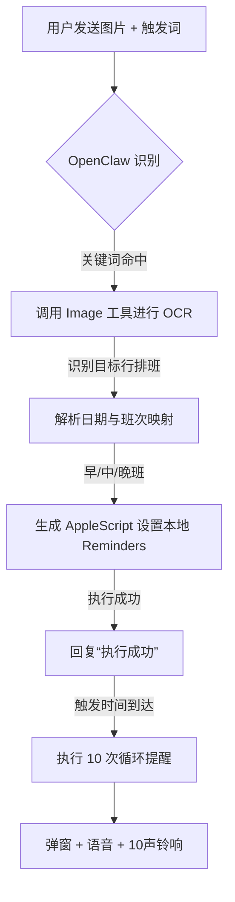

# 智能排班闹钟 Skill (smart-alarm) 技术指南 (最终版)

## 1. 功能概述
本 Skill 旨在通过识别排班表图片，自动为特定人员（已脱敏）在 macOS 系统中设置高强度的原生闹钟提醒。支持跨平台触发（飞书、微信、Webchat、iMessage 等）。

## 2. 核心逻辑与触发机制
- **触发关键词**：`智能闹钟`、`智能提醒`、`排班表`、`排班提醒`。
- **识别对象**：自动锁定排班表中特定行（目标人员）的班次信息。
- **班次映射规则**：
    - **早班 (N1-2)**：06:10 闹钟
    - **中班 (P3)**：14:10 闹钟
    - **晚班 (N3-4)**：21:10 闹钟

## 3. 技术实现方案 (AppleScript 代码)

### A. 系统原生提醒创建 (osascript)
```applescript
tell application "Reminders"
    set my_list to list 1 -- 获取默认提醒列表
    set newReminder to make new reminder at end of my_list
    set name of newReminder to "排班提醒: [脱敏人名] (班次)"
    -- 示例日期: 2026-04-02 14:10:00
    set remind me date of newReminder to date "2026-04-02 14:10:00"
end tell
```

### B. 触发时的高强度响铃逻辑 (Bash)
```bash
for i in {1..10}; do
    # 1. 系统通知中心弹窗
    osascript -e 'display notification "现在是排班提醒时间" with title "排班闹钟"'
    # 2. 自然语音播报
    say "排班时间到了，请注意。"
    # 3. 连续 10 声 Ping 铃声 (模拟闹钟音)
    afplay /System/Library/Sounds/Ping.aiff
    sleep 0.5
done
```

## 4. 业务流程图 (Mermaid)



## 5. 免确认机制
- **自动化执行**：Skill 命中后立即进行识别与设置，严禁在执行前或执行中向用户发起二次确认。
- **最终反馈**：仅在所有操作（识别 + 设置）完成后，统一回复一条“执行成功”。

## 6. 全局配置参考 (OpenClaw)
为确保跨平台生效，需在 `openclaw.json` 中配置全局 Skill 加载目录：
```json
{
  "skills": {
    "load": {
      "extraDirs": ["~/.openclaw/skills/"]
    }
  }
}
```

## 7. 故障排查与维护
- **权限检查**：确保 `terminal` 或 `openclaw` 进程具有控制 `Reminders.app` 的权限。
- **音量控制**：系统提醒触发前会自动检测并调整输出音量，确保提醒音量足够。
- **脱敏说明**：本指南已对所有具体人员姓名及特定机构名称进行脱敏处理。
