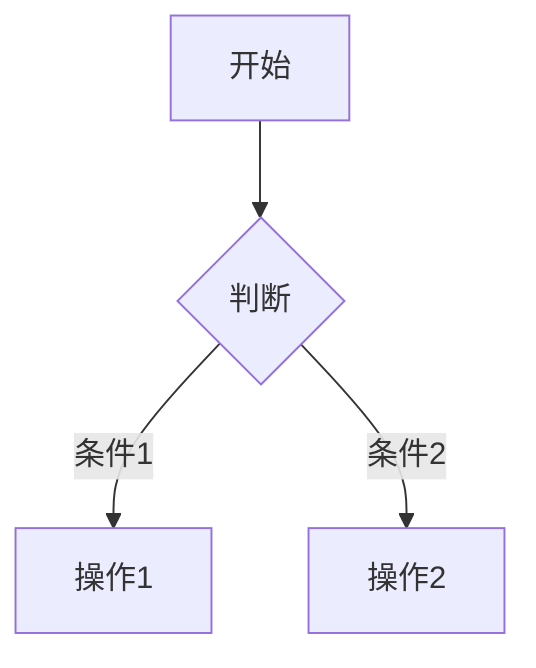

## 一、核心语法精要

### 1. 标题与段落

```markdown
# 主标题（H1）
## 二级标题（H2）
普通段落直接换行书写，空行分隔段落
2. 列表系统
无序列表项
[x] 已完成任务
[ ] 待办事项
有序列表
第二项
3. 代码展示
```python
def hello_hugo():
print("Welcome to Hugo Blog!")
```

二、Hugo增强特性

1. 短代码应用
   
   def hugo_shortcode():
   return "Hugo特色功能"
   
2. 响应式图片
   
3. 

```markdown
### 1. 基础语法
```markdown

示例：

```

三、可视化元素
流程图示例



数据表格

| 功能     | 语法示例       | 效果     |
| -------- | -------------- | -------- |
| 脚注     | 内容说明^1     | 底部注解 |
| 定义列表 | 术语: 解释说明 | 层级关系 |

启动本地预览服务命令：

```bash
hugo server -D
访问 http://localhost:1313 查看实时效果。请确保：

文件保存路径为 content/post/Markdown文档编写指南.md
已准备好示例图片 /images/md-example.png
Hugo版本 ≥ 0.89.0（支持最新短代码语法）
```
